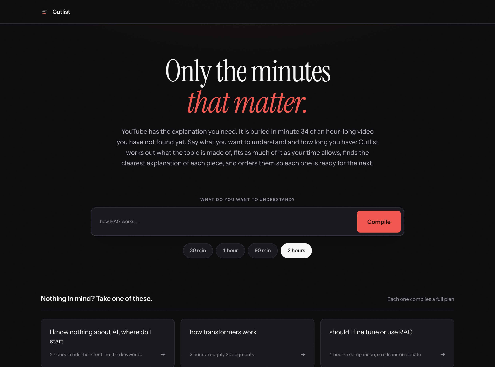
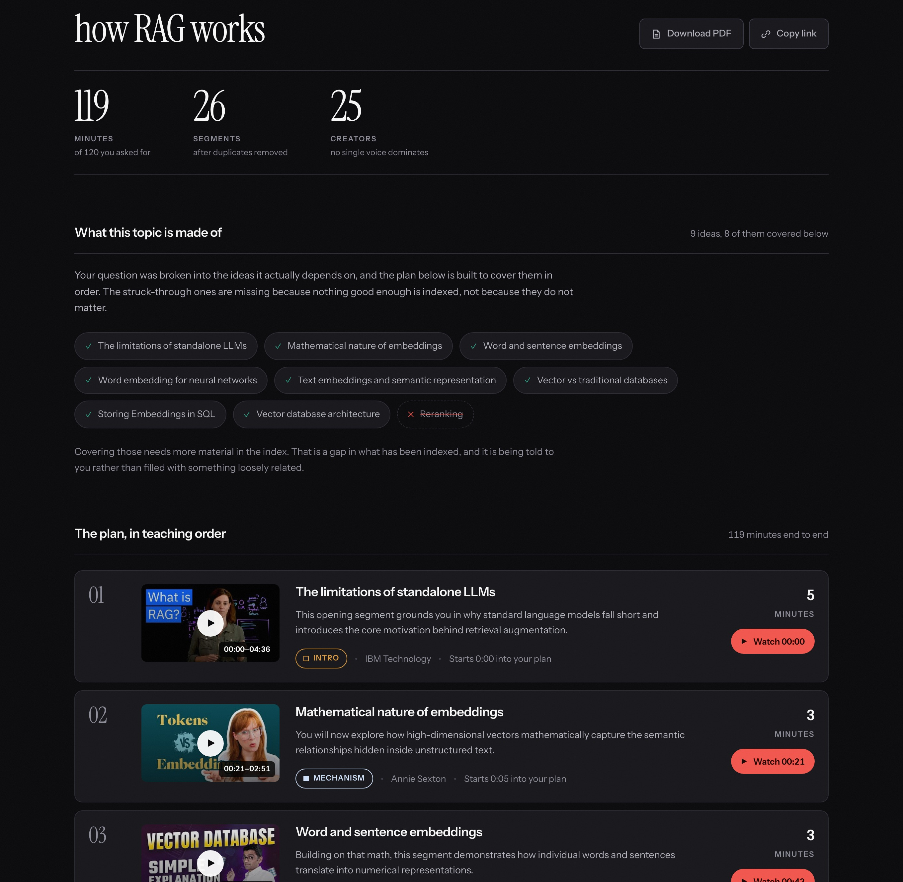

# Cutlist

[](https://cutlist-learn.vercel.app)
[](LICENSE)
[](package.json)

### Only the minutes that matter.

YouTube already has the explanation you need. It is buried in minute 34 of an
hour-long video you have not found yet.

Cutlist takes a topic and a time budget and works out what the topic is actually
made of: the ideas that have to land before it makes sense. Then it decides how
many of them fit your time, finds the clearest explanation of each across
YouTube, and sequences them so each one is ready for the next.

What comes back is a roadmap with timestamps, not a list of videos.

**[Try it, no sign-up needed](https://cutlist-learn.vercel.app)** &nbsp;·&nbsp;
[How it works](#how-it-works) &nbsp;·&nbsp;
[Measured](#measured) &nbsp;·&nbsp;
[Run it locally](#run-it-locally)



---

## What you get

Ask for *how RAG works* in two hours. The topic comes apart into the nine ideas
it depends on, and you get 26 segments from 25 creators filling 119 of your 120
minutes, ordered so each one makes sense by the time you reach it. The page
shows the breakdown above the plan, so you can see the shape of what you are
about to learn before you start.



Every row is one idea rather than one video. It carries the creator, how long it
takes, how far into your session it starts, a line saying what it gives you at
that point, and whether it orients you, explains a mechanism, works an example
or argues a position. **Watch 00:21** opens the creator's own video at 21
seconds. Nothing here is rehosted, reuploaded or embedded.

---

## Why this is not a search box

**You get a syllabus, not results.** A search box takes your words and returns
things containing them. Cutlist works out what the topic is made of first: the
nine or ten ideas that have to land before it makes sense, and the order they
have to land in. Everything below follows from having that skeleton before
anything is chosen, and you see it on the page above the plan itself.

**You watch minutes, not videos.** A search result is a 52-minute video with the
right words in the title. A plan is the four minutes inside it that answer your
question, starting at 08:12.

**You never sit through the same idea twice.** Ten creators explain embeddings,
and nine of them explain it much the same way. Segments are clustered by meaning
before anything is chosen, so your second hour goes on something new.

**The plan fits the time you actually have.** Thirty minutes and two hours are
different plans, not the same plan cut short. Filling a budget is a packing
problem, solved in code, which is why a 120-minute request comes back at 119.

**You are told what is missing.** When part of a topic has nothing good enough
behind it, that part is named on the page and struck through rather than filled
with something loosely related.

**You keep the plan.** Two ways to take it with you, and neither one stores
anything:

- **Download PDF** prints through a purpose-built stylesheet. A4 page boxes, no
  segment split across a page break, live links, and the bare
  `youtu.be/ID?t=920` printed beside every timestamp so the plan still works on
  paper. Four pages for a two-hour plan.
- **Copy link** puts the whole plan inside the URL fragment, deflated and
  base64url encoded, median 2,740 characters. A fragment is never sent to a
  server, so a shared plan needs no database and has nothing to expire, and what
  the recipient opens is byte-identical to what was sent.

---

## What is indexed

1,906 segments from 514 creators, 202 hours of source video, covering AI and
language models: embeddings, retrieval, transformers, fine-tuning, agents and
tool use.

Ask about something outside that and the answer says so rather than guessing.

---

## How it works

Eight stages. **Three call a model. Five are plain code.**

| | stage | |
|---|---|---|
| 1 | understand the request | model |
| 2 | retrieve candidates | code, cosine similarity |
| 3 | remove duplicates | code, agglomerative clustering |
| 4 | score | code, weighted formula |
| 5 | **pack to the time budget** | code, greedy set-cover then knapsack |
| 6 | order pedagogically | model |
| 7 | verify | code + model |
| 8 | render | code |

Deduplication is a similarity problem, so it belongs to embeddings. Filling a
time budget is a constraint problem, so it belongs to an algorithm. Only the
three jobs that need judgment go to a model: reading what you actually asked
for, ordering the result so it teaches, and checking that each segment is
labelled as what it really is.

The page shows all eight while it compiles, each badged `code` or `model`, and
the badges come from the same stage list the server runs. The split above is
something you can watch rather than something you have to take on trust.

### Storage

**No vector database. In production, no database at all.**

The index is written once by an offline job and only ever read afterwards.
Nothing mutates it at runtime, which makes it a file. It ships inside the
deployment as a 6.7MB bundle that loads in 20ms: half-precision vectors, and
transcripts truncated to what the verifier reads.

Search is a brute-force cosine loop, 19,060 comparisons in **34ms**, against 7
to 12 seconds of model calls in the same request. An ANN index would add a
service and a bill to speed up the part that is already 200 times smaller than
the part beside it.

---

## Measured

A hand-written golden set of 20 questions at budgets from 30 to 120 minutes,
each with what a good plan must cover and what it must not drift into, written
before any of them were run. Scoring is deterministic code.

| | |
|---|---|
| topics succeeding | 20/20 |
| plans that fill their time budget | **100%** |
| concept coverage | **96%** |
| ordering integrity | **100%** |
| minutes drifting off topic | **0** |
| escalation to an expensive model | **0%** |
| creators per plan | 18.1 |
| per plan | **11.5s, about ₹0.51** |

```bash
npm run eval                      # reproduce it, about ₹10 for all 20
npm run eval -- --compare <prev>  # diff two runs
```

---

## Run it locally

Node 22 or newer.

```bash
npm install
npm run web:demo     # localhost:4321
```

Demo mode replays one captured plan and needs no index, no API key and no
network. It times the stages the way a real run does, so the whole interface is
there to use. This is the fastest way to see the product.

Compiling for real needs your own Gemini API key and an index. The key is read
from `GEMINI_API_KEY`, or from `~/.config/gemini/api_key` if that is not set. No
key is ever read from, written to, or committed to this repository.

```bash
export GEMINI_API_KEY=your-own-key
npm run web          # localhost:4321, real compiles, about ₹0.51 each
npm run eval         # the golden set above
npm run spend        # what your key has spent so far, by what it was spent on
```

Every call goes through a ledger with a hard budget ceiling that throws rather
than warns, and a model with no price on file is refused outright, so a newly
released model cannot quietly cost you anything.

The index is not committed, because it is regenerable and large. Building one
takes a residential IP, since YouTube refuses transcript fetches from datacenter
addresses (58 of 60 succeeded from a laptop, 0 of 3 from a server):

```bash
npm run index:candidates   # plan the domain and search, free
npm run index:run          # extract and embed, this is where the money goes
npm run index:topup        # read the eval, search for exactly what is missing
npm run index:export       # build the deployable bundle that ships to production
```

Deployment, environment variables and what protects the budget are in
[DEPLOY.md](DEPLOY.md).

---

## Built with

Node, no framework and no build step. Gemini for the three model calls and for
embeddings. `youtubei.js` and `youtube-transcript` for source material. SQLite
via `node:sqlite` for indexing. Vercel for hosting.

The interface is one HTML file: dark, editorial, image-led, one serif for
display and one grotesk for everything with a job. The four depth categories are
encoded as colour **and** a glyph, with the hues measured under simulated
protanopia, deuteranopia and tritanopia rather than picked by eye. Every text
token passes WCAG AA in both themes, and all motion stops under
`prefers-reduced-motion`.

---

## License

[MIT](LICENSE). The index holds no video content, only timestamps and short
transcript excerpts used to locate and verify segments. Every link points at the
creator's own video on YouTube, and nothing is rehosted or re-uploaded.
